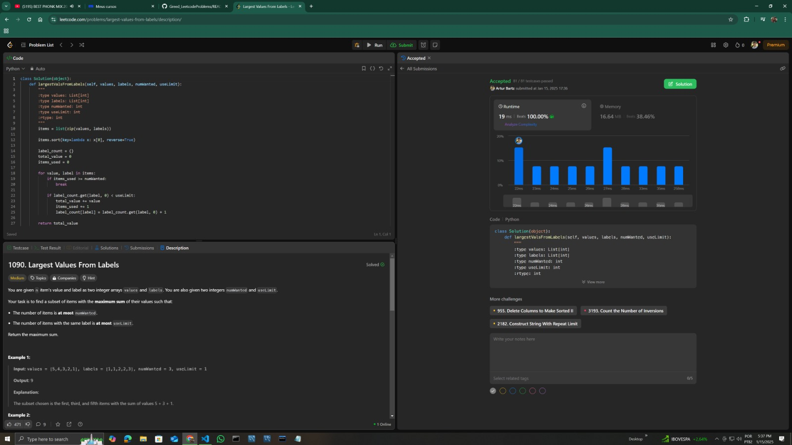

# Greed_LeetcodeProblems

**Número da Lista**: 25<br>
**Conteúdo da Disciplina**: Algoritmos Ambiciosos<br>

## Alunos
|Matrícula | Aluno |
| -- | -- |
| 221007869  |  Artur Henrique Holz Bartz |
| 221039497  |  Marcio Henrique de Sousa Costa |

## Sobre 
O projeto consiste em resolver 4 questões da plataforma LeetCode, sendo duas dífíceis e duas médias. A definição de fácil, médio e difícil é concebida pela plataforma.

Questões Implementadas:
Questão 1090. Largest Values From Labels (Dificuldade: Média). Disponível em : ([1090](https://leetcode.com/problems/largest-values-from-labels/description/));<br>
Questão 1489. Find Critical And Pseudo-Critical Edges in Minimun Spanning Tree (Dificuldade : Difícil). Disponível em : ([1489](https://leetcode.com/problems/find-critical-and-pseudo-critical-edges-in-minimum-spanning-tree/description/));<br>

## Screenshots
Screenshot da Questão 1090:<br>

Screenshot da Questão 1489:<br>


## Instalação 
**Linguagem**: Python (Questões xxx e xxx).<br>
**Framework**: Não há frameworks para este projeto.<br>
Para a execução do projeto deve ser instalado o python 3.11.4 ou superior.

## Uso 
Para rodar as questões 1090, 1489 e xxx deste projeto, basta entrar na raiz do projeto e executar o arquivo referente a questão que se deseja avaliar, por exemplo:
```
python 1090.LargestValuesFrommLabels.py
```
```
python 1489.FindCriticalAndPseudoCriticalEdgesInMinimunSpanningTree.py
```

## Vídeo
Disponível em: xxx
