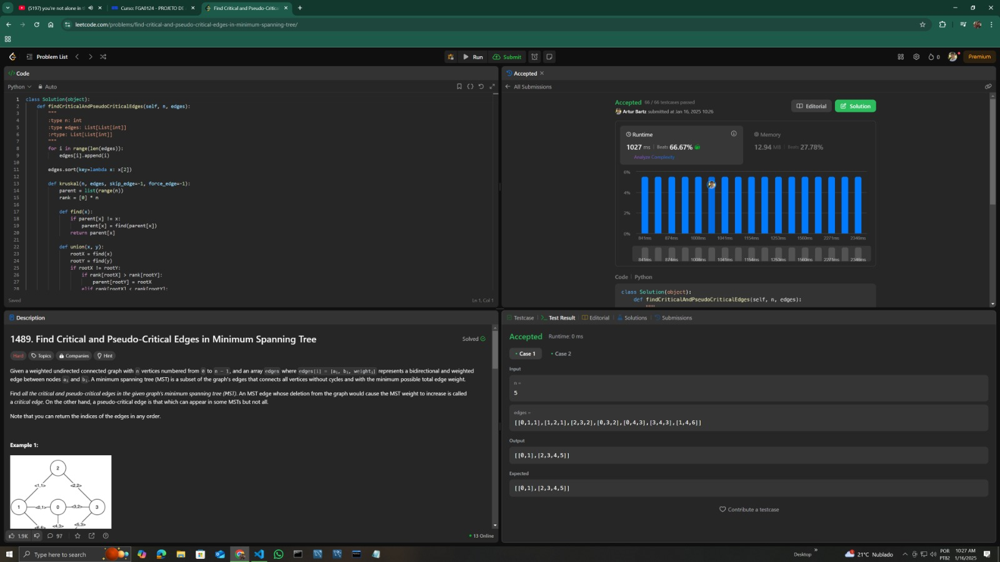
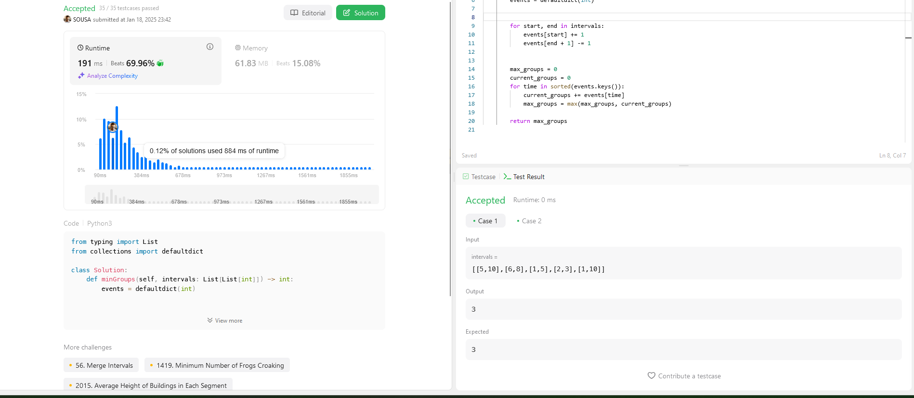

# Greed_LeetcodeProblems

**Número da Lista**: 25<br>
**Conteúdo da Disciplina**: Algoritmos Ambiciosos<br>

## Alunos
|Matrícula | Aluno |
| -- | -- |
| 221007869  |  Artur Henrique Holz Bartz |
| 221039497  |  Marcio Henrique de Sousa Costa |

## Sobre 
O projeto consiste em resolver 4 questões da plataforma LeetCode, sendo duas dífíceis e duas médias. A definição de fácil, médio e difícil é concebida pela plataforma.

Questões Implementadas:

**Artur Henrique Holz Bartz**

Questão 1090. Largest Values From Labels (Dificuldade: Média). Disponível em : ([1090](https://leetcode.com/problems/largest-values-from-labels/description/));<br>
Questão 1489. Find Critical And Pseudo-Critical Edges in Minimun Spanning Tree (Dificuldade : Difícil). Disponível em : ([1489](https://leetcode.com/problems/find-critical-and-pseudo-critical-edges-in-minimum-spanning-tree/description/));<br>

Para a solução da questão 1090 foi utilizado o algoritmo de Huffman, enquanto que para a questão 1489 foi utilizado o algoritmo de Kruskal. Os algoritmos vistos em sala de aula foram implementados com pequenas adaptações para servirem como solução das atividades dessa entrega.

**Márcio Henrique de Sousa Costa**

Questão 2406. Divide Intervals Into Minimum Number of Groups (Dificuldade: Média). Disponível em : ([2406](https://leetcode.com/problems/divide-intervals-into-minimum-number-of-groups/description/?utm_source=chatgpt.com));<br>

Para a solução da questão 2406 foi utilizado o algoritmo de com técnicas em algoritmos ambiciosos, Interval Scheduling, com uma certa adaptação ao problema que será explicada em vídeo.


## Screenshots
Screenshot da Questão 1090:<br>

Screenshot da Questão 1489:<br>

Screenshot da Questão 2406:<br>


## Instalação 
**Linguagem**: Python (Questões xxx e xxx).<br>
**Framework**: Não há frameworks para este projeto.<br>
Para a execução do projeto deve ser instalado o python 3.11.4 ou superior.

## Uso 
Para rodar as questões 1090, 1489 e 2406 deste projeto, basta entrar na raiz do projeto e executar o arquivo referente a questão que se deseja avaliar, por exemplo:
```
python 1090.LargestValuesFromLabels.py
```
```
python 1489.FindCriticalAndPseudoCriticalEdgesInMinimumSpanningTree.py
```

```
python 2406.DivideIntervalsIntoMinimumNumberofGroups.py
```

## Vídeo
Disponível em: xxx
